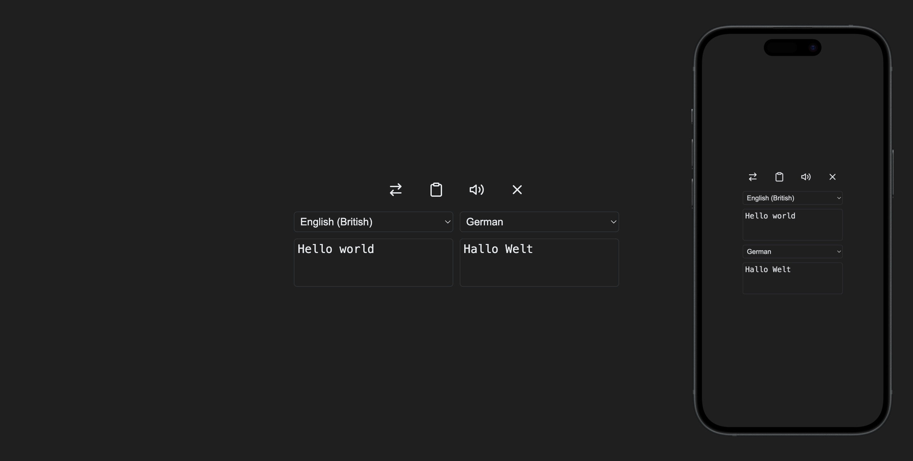

# Simple Translator

Simple Translator is a simple, yet powerful translation tool built with React,
TypeScript, and CSS. It allows users to translate text between various languages
using a third-party translation API. The app also provides additional features
like copying the translation, swapping languages, and listening to the
translation.

## Features

-   **Text Translation**: Translate text between multiple languages.
-   **Swap Languages**: Easily swap the source and target languages.
-   **Copy Translation**: Quickly copy the translated text to the clipboard.
-   **Listen to Translation**: Hear the translated text spoken aloud.
-   **Clear Text**: Clear the source text and translation with a single click.

## Screenshots

## Technologies Used

-   **React**: A JavaScript library for building user interfaces.
-   **TypeScript**: A statically typed superset of JavaScript.
-   **CSS**: For styling the application.
-   **Google Translate API**: Provides translation functionality.

Made with:

## Usage

-   Enter the text you want to translate in the source text area.
-   Select the source and target languages using the dropdowns.
-   The translation will appear automatically in the target text area.
-   Use the toolbar buttons to swap languages, copy the translation, listen to
    the translation, or clear the text.

## License

This project is licensed under the MIT License - see the LICENSE file for
details.
